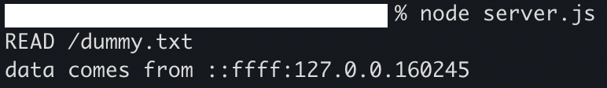

# original protocol on TCP
This protocol is a light weight protocol to transfer data between client and server. It's simple but supports CRUD(create, read, update, and delete ) functionality. You can make very simple file service with it.

# Background
I read a textbook about network. Even though I wanted to know what web servers do its deep part and how they works, It hadn't hit me yet. What's the best way to learn this? My answer was to make my own protocol based on HTTP.(Of course I know implementing HTTP server from scratch is also a really good way, but I left it for next step.)

# Protocol Overview
## Request Format
A request contains a request line and a body. The body can be empty for some method.

```
 method (sp) resource-path
 (empty line)
 body
  ```

Example
```
READ /x/y/z.txt

Hello World !
```
### Method
READ
 the READ method requests a representation of the specified resource. And the representation is saved in locally.

WRITE
The WRITE method submits a local entity to the specified resource.

DELETE
The DELETE method deletes the specified resource.

LIST
The LIST requests a list under the specified resource.

## Response Format
A response contains a status line and a body. The body can be empty for some method.

```
 status-line
 (empty line)
 body
```

Example
```
SUCCEEDED

Hello World !
```
### Status Line
SUCCEEDED
The SUCCEEDED indicates that the request has succeeded.

FAILED
THe FAILED indicates that the server failed with processing request.

# Screenshots
I made a client and server program to demonstrate a file service using this protocol. Here are its screenshots.

You can upload src.txt to the resource as dummy.txt.


You can fetch The file you uploaded and save the file locally.




This is a list under the specified resource.


You can delete the specified resource.


Consequently there are no files and directories under  " / ".


